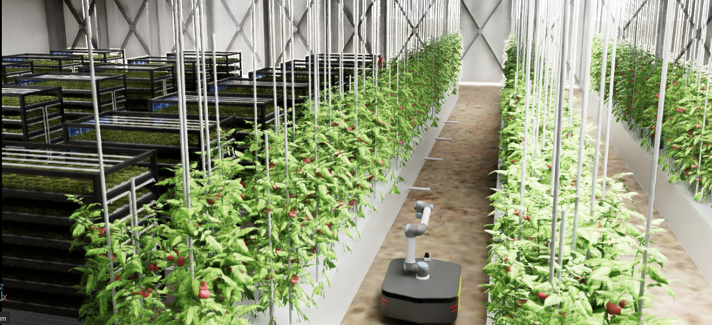
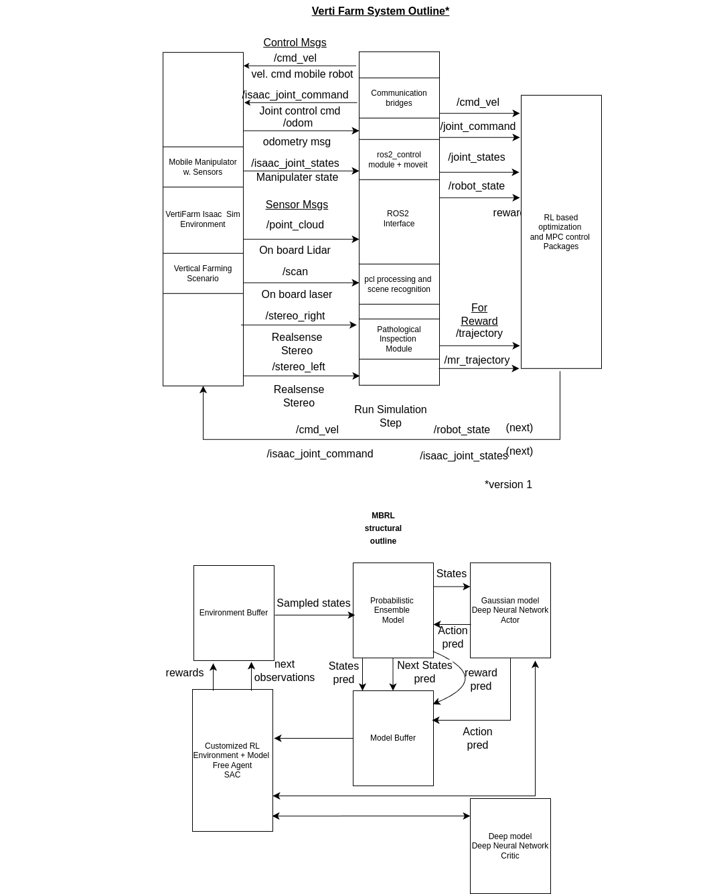

[](https://www.python.org/downloads/release/python-360/)

This repository is under construction, and the documentation will be updated soon. Please check the **`vpi` branch** for the latest updates.

---

## 🌱 **VertiFarm Project**
The VertiFarm project aims to accelerate production in vertical farming and similar environments using mobile manipulator robot infrastructure.

### 🛠️ Modules
#### **1. vertical_farm_isaac_ros**
- A customized IsaacSim environment designed for multi-agent vertical farming.
- Features mobile manipulators for various tasks (e.g., visual pathological inspection of leaves).
- Fully integrated with ROS2, providing necessary packages to:
  - Establish communication.
  - Learn various tasks and navigation using Model-Based Reinforcement Learning (MBRL) and other Machine Learning techniques.

#### **Current Experiments**
- **Model-Based RL**:
  - Mobile robot navigation and planning using visual states and latent models.
- **Domain Randomization**:
  - Procedural generation for improved learning and simulation optimization (Sim2Real).
- **Visual Pathological Inspection**:
  - Detecting plant diseases (e.g., tomato plants).

---

## 🌍 **Sample Environment**



---

## 🔧 **Temporary Workaround for Usage**
Two separate `conda` environment files (`environment.yml`) are provided for:
1. Model-Free Reinforcement Learning (MFRL).
2. Model-Based Reinforcement Learning (MBRL).

### Example Usage
#### Specify the install location:
```bash
conda env create -f environment.yml --prefix /location/to/install/env-name
 ```
#### Install at default location
 ```
 conda env create -f environment.yml
 ```
### Setting up the Isaac Sim Environment

Extract the following packages and then open the example environment `farmer2.usd` in Isaac Sim:

- `vertical_farm_isaac_ros/src/vertifarm/omni_assets/TIF/Collected_farmer/farmer2.tar.xz`
- `vertical_farm_isaac_ros/src/vertifarm/omni_assets/TIF/Collected_farmer/TIF/vert/t1.tar.xz`

### Setting up MoveIt Support and ROS2 Packages

The current version supports **ROS2 Humble** and **MoveIt2**. You can follow the general [instructions](https://docs.ros.org/en/eloquent/Tutorials/Creating-Your-First-ROS2-Package.html#build-a-package) to build the relevant packages inside the `src` folder within the **vertical_farm_isaac_ros** workspace.

### Training the Algorithm

#### Architectural Outline



#### Training

The current setup is simple to run and can be applied to run multiple runs with different hyperparameters. The config files are under `/model_based/mbpo/config`. To run the experiment with one selection of parameters, you can replace the config variable with `config_one.yaml` in the script `automate.py`. 

To run it with multiple parameters, you can fill in the `config.yaml` with the testing parameters and replace the file name in the config variable.

**Note**: To run the training, it is necessary that Nvidia Isaac Sim has been installed and the Python environment is set up properly. For installation instructions and setup, please follow the instructions [here](https://docs.omniverse.nvidia.com/isaacsim/latest/installation/index.html). You can also see how to set up and use Isaac Sim's Python environment [here](https://docs.omniverse.nvidia.com/isaacsim/latest/manual_standalone_python.html).

Once the setup is complete, you can run the training simply by the following commands:

```bash
cd /path/to/isaac/sim/
```
For Example,```/home/omni/omni/library/isaac-sim-4.1.0/```
```bash
./python.sh /path/to/file/automate.py
```

## Popular RL Algorithms are also Implemented as Prior Research (Still to be Integrated with the Environment)

#### Deep Learning-based Model-Free RL Algorithms
*(The algorithms require gymnasium >= 0.26)*

- DDPG
- DQN / DDQN
- PPO
- TD3
- SAC

#### Model-based RL Algorithms (MBRL)
*(The algorithms require gymnasium v1.0.0 alpha 2)*

- MBPO experimentation with Probabilistic Neural Network ensemble as world model and VertiFarm as the true Environment
- DYNAQ / DYNAQ+

#### Hindsight Experience Replay (HER) Algorithms
*(The algorithm requires gymnasium >= 0.26)*

- With DDPG

## Resources That Inspired the RL Implementations

The following resources have significantly contributed to the reinforcement learning implementations in this project:

1. **Reinforcement Learning and Learning-Based Control (SoSe 2022)**  
   *Prof. Sebastin Trimpe* - RWTH Aachen University, Germany

2. **[DLR stable-baselines3](https://github.com/DLR-RM/stable-baselines3/tree/master)**  
   A collection of high-quality RL algorithms built on stable-baselines3.

These resources provided key insights and methodologies that were integrated into our RL approach.
