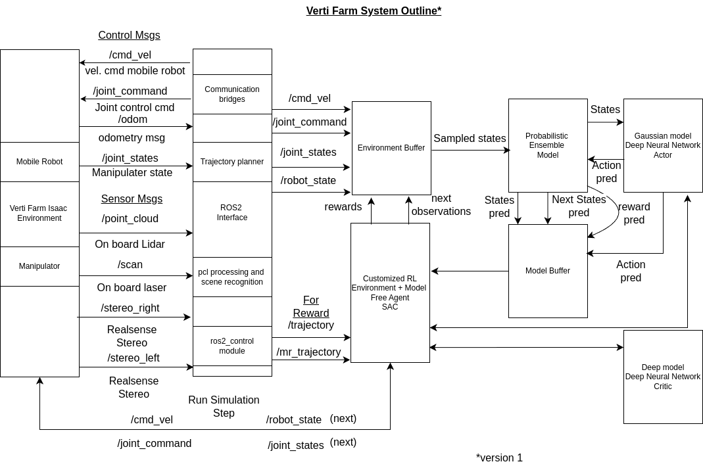

# The Vertifarm Project

## Note
Please note that this repository is under construction, the notes on using the repository will be updated soon. Check **vpi branch** for the latest updates.

# VertiFarm project
The vertiFarm project is aimed to accelerate production in vertical farming and similar environments with mobile manipulator robot infrastructure.

##  The project is under contruction. The modules are as follows
   ### RL Algorithms 
   #### Deep learning based Model Free RL algorithms(The algorithms require gymnasium >=0.26 )
   - DDPG
   - DQN / DDQN
   - PPO
   - TD3
   - SAC
   #### Model based RL algorithms (MBRL) (The algorithms require gymnasium v1.0.0 alpha 2)
   - MBPO experimentation with Probabilistic Neural Network ensemble as world model and VertiFarm as the true Environment
   - DYNAQ / DYNAQ+
   #### Hingsight Experience Replay(HER) algorithms(The algorithm requires gymnasium >=0.26 )
   - With DDPG
   ### vertical_farm_isaac_ros
   The IsaacSim environment customized for Multi Agent vertical farming, equipped with mobile manipulators to perform various tasks (current showcase focuses on visual pathalogical inspection of leaves). Current environment is fully connected with ros2 and aims to provides the necessary packages to establish communication, learn different tasks and navigation through MBRL and other Machine Learning menthods. 

### Architecture of MBRL experimentation with MBPO, SAC, Probabilistic Neural Network ensemble as world model and VertiFarm as the true Environment



## Sample Environment


https://github.com/AK2420022/rl_mine/assets/19958594/0487f15a-92ec-48b9-af7d-16069d94def6

## Temproary workaround to support usage
 There are two different conda environment.yml files provided for each mfrl and mbrl algorithms seperately. Depending on the algorithm the irrescpective conda environment can be installed and used. 
 ### Example usage
 #### Install at default location
 ```
 conda env create -f environment.yml --prefix /location/to/install/env-name
 ```
 #### Specify the install location
 ```
 conda env create -f environment.yml
 ```

